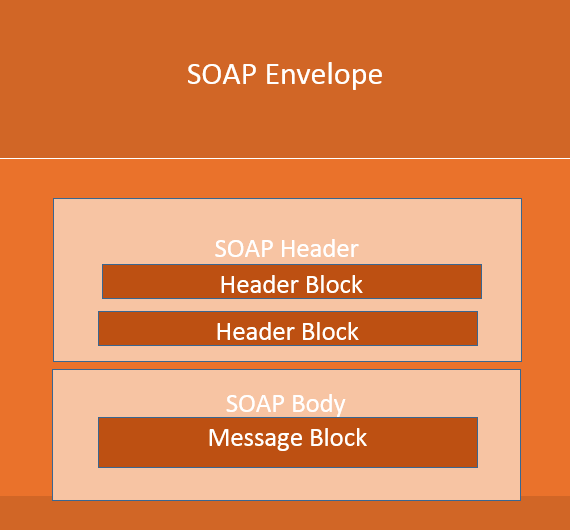
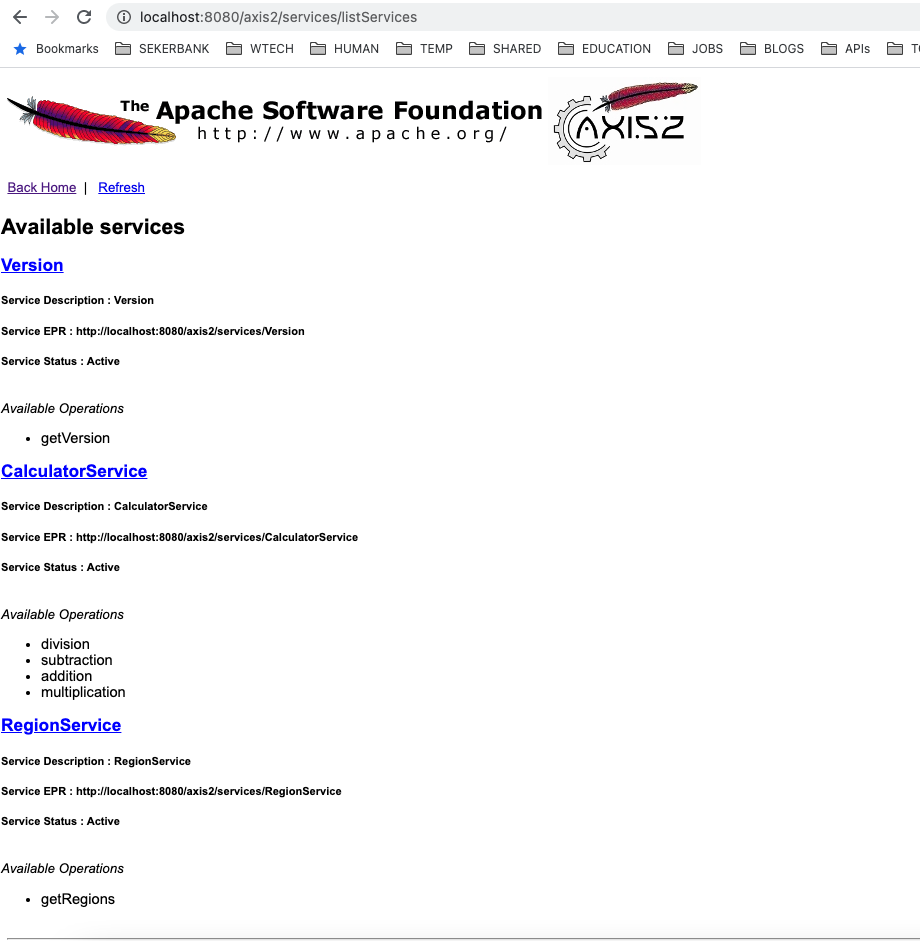

* ### Referanslar
    Bu çalışmadaki örnekler **simple-soap-server** adlı projedede kodlanmıştır.
    
* ### Kavramlar
- SOAP(Simple Object Access Protocol): HTTP üzerinden web hizmetlerine erişim için kullanılan XML tabanlı bir protokoldür. 
- SOAP :  WEB servis yapmak için kullanılır.
- JAX-WS : Java API for XML Web Services -> SOAP
- JAX-RS :  JAVA API for RESTful Web Services -> Javada RESTFULL yaparken kullanılacak standartları barındırır -> REST
- WSDL : Web Services Description Language 

* ### SOAP/REST    
- SOAP ta XML kullanılır(zorunlu olarak). REST te bir kısıtlama yoktur. JSON,XML yada TEXT dönülebilir.
- SOAP ta request ve responselar bir standarta bağlanmıştır. REST te ise bağımsız bir design yapılabilir.

    
- SOAP içindeki kurallar ve standartlar nedeniyle REST'e göre biraz ağır kalır ancak yinede SOAP standartları gereği kurumsal camiada ilgi görür ve uygulamalarda çokça kullanılır.      
- Rest URL ile methodları ilişkilendirir. Her method(endpoint) için ayrı bir URL gereklidir. localhost/users yada localhost/users/1
- SOAP ta ise URL sabittir  aynı nesnenin farklı methodlarına erişim vardır. 
- Her iki teknolojide de dile bağımlılık yoktur. Java,PHP  veya C#  gibi dillerle hem REST hem de SOAP servisler yazılabilir.
- REST HTTP protokolünü kullanmaya zorlar ancak SOAP ta HTTP ninde üzerine inşa edildiği TCP-IP protokolü direk kullanılabilir.

* ### Apache Axis 
- Axis,  Apache tarafından geliştirilmiştir.
- JAX-WS : Web servis geliştirmesi yapmak için tanımlanan Java standartıdır 
- Axis ise Javada JAX-WS standartlarında SOAP işlemleri için kullanılan bir librarydir.
- Axis JAX-WS'in bir implementasyonudur denebilir özetle.
- Axis2 ise Axis ten farklı olarak yine aynı implementasyonu farklı algoritmalarla yapana bir apache librarysidir.

* ### Tomcat konfigürasyonu
- Geliştirilen WS'in deploy edilebilmesi için bir uygulama sunucusu indirilir.
- Bu çalışmada Apache Tomcat/7.0.47 kullanılmıştır. (Download  :https://archive.apache.org/dist/tomcat/)
- indirme işleminden sonra tomcat'e yazma ve çalıştıma yetkisi verilir.
```
$ chmod -R  0777 ~/development/servers/tomcat7/bin
```    
- Tomcat'in manager ekranlarına erişim için roller tanımlanır.
```
$ vi ~/development/servers/tomcat7/conf/tomcat-users.xml
```
- tomcat-users.xml dosyasına tanımlanacak roller
```
<tomcat-users>
    <role rolename="admin-gui"/>
    <role rolename="manager-gui"/>
    <role rolename="tomcat"/>
    <role rolename="role1"/>
    <user username="admin" password="admin" roles="tomcat,role1,admin-gui,manager-gui"/>
</tomcat-users>
```

- Axis WAR dosyası olarak indirilip tomcat'e deploy edilir.
- Bu çalışmada Axis2-1.7.0.war versiyonu kullanılmıştır (Download : http://archive.apache.org/dist/axis/axis2/java/core/1.7.0/) 
```
$ cp ~/Downloads/axis2-1.7.0-war/axis2.war ~/development/servers/tomcat7/webapps/
```
- WAR dosyasının açılıp axis'in ayağa kalkması için  Tomcat restart edilir.
```
$ ~/development/servers/tomcat7/bin/shutdown.sh; ~/development/servers/tomcat7/bin/startup.sh
```    

- war dosyası olarak deploy edilen axis2.war  dosyasının içeriği restart işleminden sonra aşağıdaki dizine çıkarlır. 
```
$ls ~/development/servers/tomcat7/webapps/axis2
```    

* ### Web Servis(SOAP) Kodlama
- üstteki adımlardaki konfigurasyonlar uygulandıktan sonra kodlama kısmına geçilebilir.
- ilk olarak services.xml dosyasına ilgili servis tanımları eklenir.
```
resources/services.xml
```

- Class ve Methodların service.xml dosyasına eklenmesi.
```
<serviceGroup>
    <service>
    ...
    </service>

    <service name="RegionService">
        <description>
            Bölge Servi̇sleri̇
        </description>

        <parameter name="ServiceClass">com.ba.service.RegionService</parameter>

        <operation name="getRegions">
            <messageReceiver class="org.apache.axis2.rpc.receivers.RPCMessageReceiver"/>
        </operation>

    </service>
</serviceGroup>
```

- Pom  xml'e AAR paket alacak build plugin'inin eklenmesi 
```
<build>
    <plugins>
        <plugin>
            <groupId>org.apache.axis2</groupId>
            <artifactId>axis2-aar-maven-plugin</artifactId>
            <configuration>
                <servicesXmlFile>${basedir}/src/main/resources/services.xml</servicesXmlFile>
            </configuration>
            <executions>
                <execution>
                    <phase>package</phase>
                    <goals>
                        <goal>aar</goal>
                    </goals>
                </execution>
            </executions>
        </plugin>
    </plugins>
</build>
```

- Bu aşamadan sonra geliştirilen maven projesi paketlenerek axis2 dizininde ayağa kaldırılabilir.
```
$ rm -rf ~/development/servers/tomcat7/webapps/axis2/WEB-INF/services/simple-soap-server*;  cd ~/development/git/sbank-workshop/axis2-soap-examples/simple-soap-server/; mvn clean package; cp target/simple-soap-server-1.0.aar ~/development/servers/tomcat7/webapps/axis2/WEB-INF/services/; ~/development/servers/tomcat7/bin/shutdown.sh; ~/development/servers/tomcat7/bin/startup.sh
```

* ### Browserdan kontroller
- CalculatorService,RegionService ve bu classların methodları listede görülür.
    

* ### HTTP erişiemler
- Tomcat Main : http://localhost:8080
- Services : http://localhost:8080/axis2/services/listServices
- WSDL :  http://localhost:8080/axis2/services/CalculatorService?wsdl

* ### Kaynaklar
- https://www.rukspot.com/blog/how_to_setup_axis_2_with_apache_tomcat
- https://www.rukspot.com/blog/axis_2_sample_web_service_with_maven_and_eclipse
- https://www.rukspot.com/blog/axis_2_sample_web_service_client_with_maven_and_eclipse
- https://www.journaldev.com/9131/soap-webservices-in-java-example-eclipse

[index için tıklayın](../README.md)
