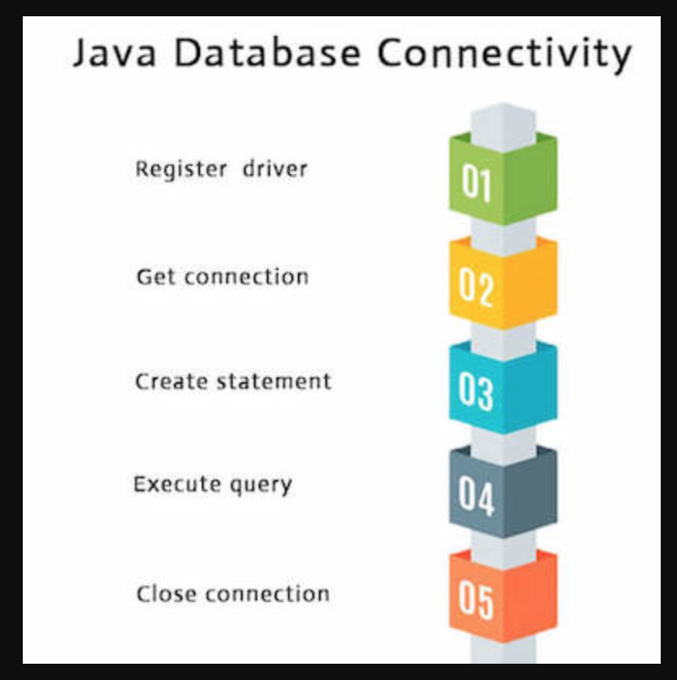

* ### Referanslar
    Bu çalışmadaki örnekler **com.samples.jdbc** adlı pakette  kodlanmıştır.

* ### Açıklamlar
    Java’da veritabanı işlemleri için JDBC(Java Database Connectivity) API kullanılır. 
     

* ### JDBC Connection bilgileri
    **com.samples.jdbc.Constants** class'ında DB bilgileri constant değerler olarak tutulmaktadır.
    ```
    public static final String USER = "root";
    public static final String PASS = "1234567890";
    public static final String DB_URL = "jdbc:mysql://localhost/";
    public static final String DB_URL_WITH_DB = "jdbc:mysql://localhost/STUDENTS";
    public static final String JDBC_DRIVER = "com.mysql.jdbc.Driver";
    ```

* ### Veritabanı Driver'ının tanımlanması
    DB driverı JDBC tarafından kullanılabilmesi için register edilir. 
    ```
    Class.forName(Constants.JDBC_DRIVER);
    ```
    
    Class.forName(...) ile Class'ın instance'ı get edilir.

* ### Veritabanına bağlanma
    Driver manager üzerinden aşağıdaki şekilde DB bağlantısı açılır.
    ```
    DriverManager.getConnection(Constants.DB_URL_WITH_DB, Constants.USER, Constants.PASS);
    ```

* ### Statement oluşturma
    Sorgular statement üzerinden çalıştırılacağı için, oluşturulan DB bağlantısı üzerinden bir statement oluşturulur.
    ```
    statement = connection.createStatement();
    ```

* ### Sorgu çalıştırma
    insert örneği
    ```
    String sql = "INSERT INTO REGISTRATION VALUES (100, 'Ali', 'TURAN', 18)";
    statement.executeUpdate(sql);
    ```
    
    update örneği
    ```
    String sql = "UPDATE REGISTRATION SET age = 30 WHERE id in (100, 101)";
    statement.executeUpdate(sql);
    ```
    
    delete örneği
    ```
    String sql = "DELETE FROM REGISTRATION WHERE id = 101";
    statement.executeUpdate(sql);
    ```
    
    select örneği
    ```
    String sql = "SELECT id, firstname, lastname, age FROM REGISTRATION";
    ResultSet rs = statement.executeQuery(sql);
    ```

    **NOT:** Select işleminden sonra statementtan dönen ResultSet üzerinden gelen verilere erişilebilir.
    ```
    while (rs.next()) {
        //Retrieve by column name
        int id = rs.getInt("id");
        int age = rs.getInt("age");
        String firstname = rs.getString("firstname");
        String lastname = rs.getString("lastname");
    
        System.out.println("ID : " + id + " - Age : " + age + " - Firstname : " + firstname + " - Lastname:" + lastname);
    }
    ```

* ### bağlantıların kapatılması
    SQL işlemleri bittikten sonra connection ve statement finaly blok içinde close edilir
    ```
    } finally {
        //finally block used to close resources
        try {
            if (statement != null)
                statement.close();
        } catch (SQLException se) {
        }
        try {
            if (connection != null)
                connection.close();
        } catch (SQLException se) {
        }
    }
    ```

* ### Bağımlılıklar(Dependency)
    Çalışmada MySQL veritabanı kullanılmıştır. Bunun için MySQL pom.xml dosyasına dependency olarak eklenmeldir.
    ```
    <dependency>
        <groupId>mysql</groupId>
        <artifactId>mysql-connector-java</artifactId>
        <version>8.0.21</version>
    </dependency>
    ```
    

* ### kaynaklar
    - https://www.tutorialspoint.com/jdbc/jdbc-create-database.htm
    

[index için tıklayın](../README.md)
