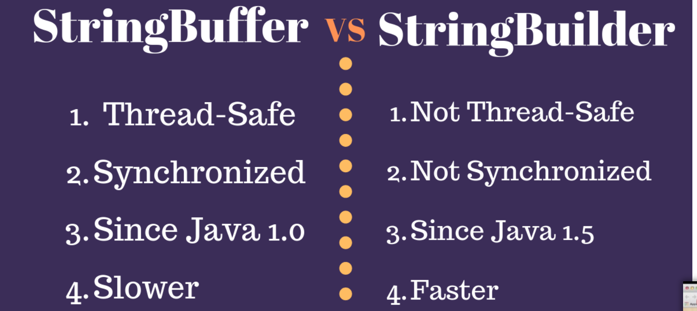

* ### Referanslar
    Bu çalışmadaki örnekler **com.samples.stringconcat** adlı pakette  kodlanmıştır.


* ### açıklamalar
    - String class'ı immutable(değişmez) dur.
    - StringBuilder ve StringBuffer classları mutable dur.
    - String class'ı üzerinden yapılacak her concatene işleminde yeni bir String objesi oluşacağı için performans düşüktür.
    - Performans nedenlerinden dolayı String birleştirme(manipulasyonlar) StringBuffer ve StringBuilder ile yapılır.
    - StringBuffer, thread-safe ve synchronized dır. StringBuilder bu şekilde tasarlanmamıştır. Dolayısıyla StringBuilder StringBuffer dan daha hızlıdır.
     

* ### performans
    Performans değerlendirmesi adına bu çalışmada String üzerinden, StringBuffer üzerinden ve StringBuilder üzerinden 100000000 kez birleştirme işlemi denenmiştir.
    Performans sonuçları aşağıdadır.
    
    String sonucu
    ```
    sonuç:15 sn
    --- String performance ---
    Time Taken:15695
    Memory used:-600409000
    ```

    StringBuffer sonucu
    ```
    sonuç: 4 sn
    --- StringBuffer performance ---
    Time Taken:4885
    Memory used:3044424
    ```

    StringBuilder sonucu
    ```
    süre:3.5 sn
    --- StringBuilder performance ---
    Time Taken:3685
    Memory used:5719912
    ```

* ### önemli notlar
    String append işleminde süre uzun olacağı için döngü 1/1000 oranına düşürülmüştür. Buna rağmen yine diğerlerinden yavaştır.
    ```
    for (int i = 0; i < Constants.STRING_APPEND_LIMIT / 1000; i++) {..}
    ```

* ### kaynaklar
    - https://www.journaldev.com/538/string-vs-stringbuffer-vs-stringbuilder
    


[index için tıklayın](../README.md)
