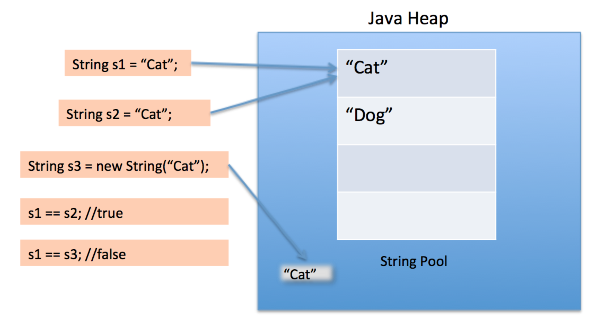

* ### Referanslar
    Bu çalışmadaki örnekler **com.samples.string.sample1.Run** adlı class ta kodlanmıştır.

* ### Açıklamalar
- String, referans türünde bir veri tipidir.
- new keywordü olmadan da string değişken oluşturulabilir.
- String objeleri immutabledur(değişmez)
    Aşağıdaki örnekte name değişkeni için ayrılan obje(ahmet) değişiştirilmez. Değeri Can olan yeni bir String objesi yaratılır.
    ```
    String name = "Ahmet";
           name = "Can";
    ```
- String pool  alanı içinde sadece string sabitleri tutan özel bir heap alandır.
- new keywordü olmadan tanımlanan string değerler heap teki string pool da tutulurlar.  
    aşağıdaki örnekte **pool** da sadece 1 adet **String** objesi bulunmaktadır. **Stack** teki **name ve isim** alanları **heap** teki bu alanı point ederler.
    ```
        String name = "Ahmet";
        String isim = "Ahmet";
    ```
    string pool örnek şeması aşağıdaki gibidir.
        
- String lerin char array olduğunu söylenebilir ancak Stringler primitive değil Class olduğu için daha kabiliyetlidir.
- String sınıfı Object sınıfını extends eder.
- String sınıfının 10 dan fazla constructoru, 60 dan fazla metodu vardır.

- Aşağıdaki iki ifade birbirine eşdeğerdir.
```
String str = "abc";
```

```
char data[] = {'a', 'b', 'c'};
String str = new String(data);
```

* ### Kaynaklar
    - https://www.geeksforgeeks.org/storage-of-string-in-java/
    - https://www.journaldev.com/797/what-is-java-string-pool
    - https://docs.oracle.com/javase/8/docs/api/java/lang/String.html


[index için tıklayın](../README.md)
