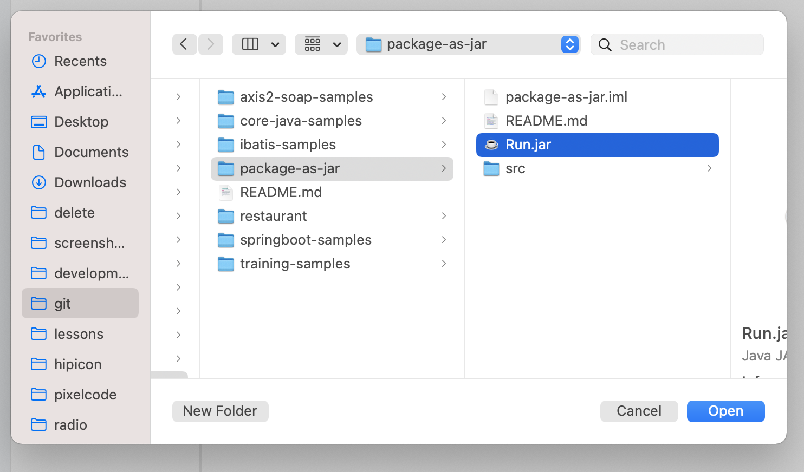
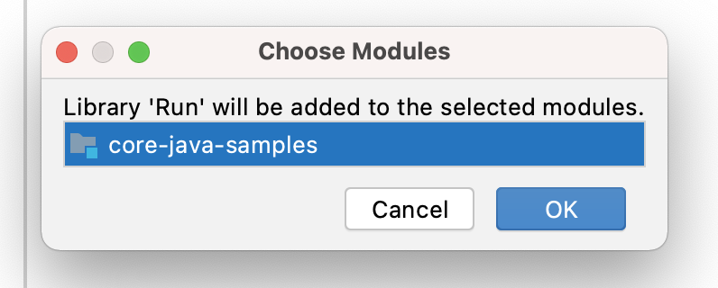
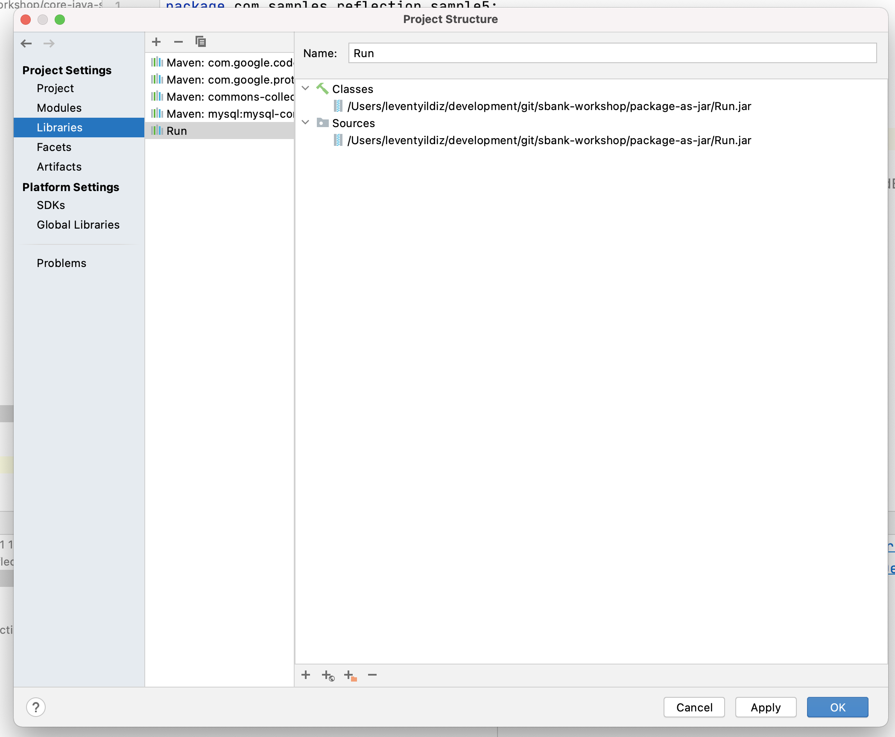

#### navigate to source
    ```
    $ cd package-as-jar/src
    ```

#### run build script
    ```
    $ ./script.sh
    ```

#### Add JAR as dependency
Paketlenen JAR dosyasının farklı projelerde kullanılabilmesi için aşağıdaki şekilde librar olarak idea'ya eklenmesi gerekir.






[index için tıklayın](../README.md)
