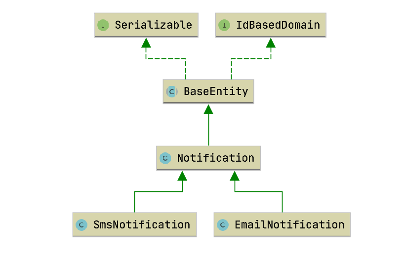

* ### Tanımlar
    OOP dünyasında adı sık duyulan kavramlardan biri de inheritance tır. 
    Hibernate ile entityler oluşturulurken de tekrardan kaçmak amacıyla inheritance tan faydalanmak gerekir.
    @Inheritance anotasyonu ile hibernate entityleri arasındaki kalıtım ilişkisi kurulmuş olur.

    @Inheritance'ın aldığı strategy değerleri aşağıdaki gibidir.
    - SINGLE_TABLE     
    - TABLE_PER_CLASS     
    - **JOINED**               
    ```
    @Entity
    @Table(name = "notification")
    @Inheritance(
            strategy = InheritanceType.JOINED
    )
    public class Notification extends BaseEntity {...}
    ```

* ### Diagram
    Uygulamada kullanılan Entitylerin birbirleriyle ilişkisini gösteren Class diagramı aşağıdaki gibidir.
    Bu çalışmada **SmsNotification** ve **EmailNotification** entitylerinin ortak özellikleri **Notification** kısmında toplanarak kod tekrarından kaçılmıştır.
    
    
* ### BaseEntity
    BaseEntity class'ında id değeri tanımlanmıştır. Bu classtan extends edilecek classlar da tekrar id tanımı yapılmaması için tanım burada yapılmıştır.
    **id, private** olarak tanımlandığı için dışardan id değerine erişim için  **getId()** ve **setId()** methodları olamaldır. 
    Bu sebeple **BaseEntity** class'ı **IdBasedDomain** arayüzünü implement eder.
    ```
    @MappedSuperclass
    public abstract class BaseEntity implements IdBasedDomain,Serializable {
    
        @Id
        @GeneratedValue(strategy = GenerationType.IDENTITY)
        private Long id;
    
        @Override
        public Long getId() {
            return id;
        }
    
        @Override
        public void setId(Long id) {
            this.id = id;
        }
    }
    ```    
    
    **BaseEntity**'den instance oluşurmayı(new) engellemek için **BaseEntity abstract class** olarak tanımlanmıştır.
    Entity'nin tepesindeki **@MappedSuperclass** anotasyonu ise hibernate'e bu class tan DB tarafında tablo yaratmasını engellemek için kullanılmaktadır. 
    ```
    @MappedSuperclass
    ```

* ### IdBasedDomain
    **BaseEntity**'deki id değşkenine getter-setter eklemeden erişim mümkün olmayacağı için getter-stter implementasyonunu zorunlu hale getirmek gerekmetedir.
    Dolayısıyla bu zorululuk için çalışmada **IdBasedDomain** adında bir interface oluşturularak entity'nin bu interface'i implement etmesi sağlanmıştır.

    ```
    public interface IdBasedDomain {
        Long getId();
    
        void setId(Long id);
    }
    ```

* ### Notification
    **Notification** class'ı **BaseEntity** classını extends ettiği için burada yeniden id değişkeni tanımlamaya ihtiyaç yoktur.
    Bu classın içinde artık sadece **Notification**'u ilgilendiren değişkenler tanımlanabilir.
    
    ```
    @Entity
    @Table(name = "notification")
    @Inheritance(
            strategy = InheritanceType.JOINED
    )
    public class Notification extends BaseEntity {
    
        private String firstName;
    
        private String lastName;
    
        private String content;
    ```

* ### SmsNotification
    Üsttekine benzer şekilde **SmsNotification** classı da  **Notification** class'ını extends etmektedir. 
    Dolayısıyla SmsNotification classı hiyerarşik bir şekilde üst classların özelliklerini almaktadır.
    Bu nedenle SmsNotification classında  **id,firstName,lastName ve content** tanımı yapmaya gerek yoktur.
    ```
    @Entity
    public class SmsNotification extends Notification {
    
        private String phoneNumber;
    
        public SmsNotification() {
        }
    
        public SmsNotification(String firstName, String lastName, String content, String phoneNumber) {
            super(firstName, lastName, content);
            this.phoneNumber = phoneNumber;
        }
    
        public String getPhoneNumber() {
            return phoneNumber;
        }
    
        public void setPhoneNumber(String phoneNumber) {
            this.phoneNumber = phoneNumber;
        }
    }
    ```
* ### PrimaryKey lerle ilişki kurulması
    Hibernate **@Inheritance** anotasyonu ile varsayılan olarak üst tablodaki **primary keyler(ID)** ile alt tabloları bağlar.
    Bu çalışmada **Notification** tablosundaki id ile **SmsNotification** ve **EmailNotification**  tablolarındaki id alanı beslenmektedir. 

* ### End-point ler ile CRUD işlemleri
    Sms notification'ı ekleme
    http://localhost:8080/notification/sms/add
    
    Email notification'ı ekleme
    http://localhost:8080/notification/email/add
    
    Db deki notification'u Id değeriyle alma
    http://localhost:8080/notification/5
    
    DB deki tüm notificationları listeleme
    http://localhost:8080/notification/list
    
    ID:3 olan kaydı silme
    ```
    curl --location --request DELETE 'http://localhost:8080/notification/delete/3'
    ```    

* ### Hibernate SQL logları
    Insert notification logu
    ```
    Hibernate: 
        insert 
        into
            notification
            (id, content, first_name, last_name) 
        values
            (null, ?, ?, ?)
    ```    

    Insert SmsNotification logu
    ```
    Hibernate: 
        insert 
        into
            sms_notification
            (phone_number, id) 
        values
            (?, ?)
    ```

    ######NOT: notification tablosune insert atarken aynı zamanda sms_notification tablosuna da insert yapar.

    Select logu(ilişkili tüm tabloları ID üzerinden joinler)
    ```
    Hibernate: 
        select
            notificati0_.id as id1_3_0_,
            notificati0_.content as content2_3_0_,
            notificati0_.first_name as first_na3_3_0_,
            notificati0_.last_name as last_nam4_3_0_,
            notificati0_1_.email as email1_2_0_,
            notificati0_2_.phone_number as phone_nu1_6_0_,
            case 
                when notificati0_1_.id is not null then 1 
                when notificati0_2_.id is not null then 2 
                when notificati0_.id is not null then 0 
            end as clazz_0_ 
        from
            notification notificati0_ 
        left outer join
            email_notification notificati0_1_ 
                on notificati0_.id=notificati0_1_.id 
        left outer join
            sms_notification notificati0_2_ 
                on notificati0_.id=notificati0_2_.id 
        where
            notificati0_.id=?
    ```    

    Delete logu
    ```
    Hibernate: 
        delete 
        from
            email_notification 
        where
            id=?
    ```    
    
    ```
    Hibernate: 
        delete 
        from
            notification 
        where
            id=?
    ```   
    ###### NOT: Hibernate notification tablosundan veri silerken  aynı zamanda email_notification tablosundan da ilişkili kaydı siler.

* ### Kaynaklar
    - https://vladmihalcea.com/the-best-way-to-use-entity-inheritance-with-jpa-and-hibernate/
    - https://gist.github.com/dungdm93/22eb53b95030b641e2cb/0559be2082b7786212942d3dd264a18498944fa1


[index için tıklayın](../README.md)
