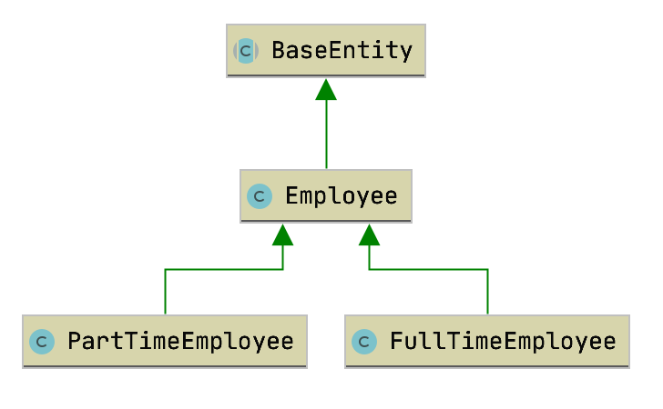
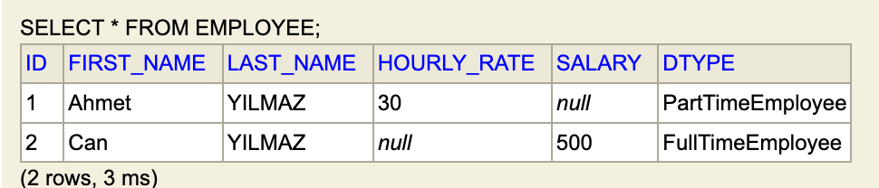

* ### Tanımlar
    Bu çalışmada @Inheritance anotasyonu SINGLE_TABLE stratejisiyle incelenecektir.
    @Inheritance'ın aldığı strategy değerleri aşağıdaki gibidir.
    - **SINGLE_TABLE**     
    - TABLE_PER_CLASS     
    - JOINED               
    
    ```
    @Entity
    @Table(name = "employee")
    @Inheritance(
            strategy = InheritanceType.SINGLE_TABLE
    )
    public class Employee extends BaseEntity {...}
    ```

* ### Diagram
    Uygulamada kullanılan Entitylerin birbirleriyle ilişkisini gösteren Class diagramı aşağıdaki gibidir.
    Bu çalışmada **FullTimeEmployee** ve **PartTimeEmployee** entitylerinin ortak özellikleri **Employee** kısmında toplanarak kod tekrarından kaçılmıştır.
    
   
* ### Employee
**InheritanceType.SINGLE_TABLE** stratejisiyle inherit edilen tablolar için ayrı bir tablo yaratılmayacaktır.
Employee class'ın belirtildiği üzere employee adında bir tablo oluşturulacaktır.
hem FullTimeEmployee hem de PartTimeEmployee bilgileri employee tablosunda saklanacaktır.

```
@Entity
@Table(name = "employee")
@Inheritance(
        strategy = InheritanceType.SINGLE_TABLE
)
public class Employee extends BaseEntity {
    private String firstName;
    private String lastName;
}
```

Single table stratejisiyle tabloların ilişkilemndirilmesi
```
@Inheritance(
        strategy = InheritanceType.SINGLE_TABLE
)
```
 
* ### FullTimeEmployee
FullTimeEmployee adlı entity Employee'dan extend edilerek Employee class'ının özelliklerini almıştır.
```
@Entity
public class FullTimeEmployee extends Employee {
    private int salary;
    ...
}
```
* ### PrimaryKey lerle ilişki kurulması
   primary key'e ihtiyaç yoktur. ilişki Discriminator anlamına gelen DTYPE   kolonunda tutulur.
    

* ### End-point ler ile CRUD işlemleri  
    Full time employee ekleme
    http://localhost:8080/employee/full-time/add
    
    Part time employee ekleme
    http://localhost:8080/employee/part-time/add
    
    Kayıtları listeleme
    http://localhost:8080/employee/list
    
    ID:2 olan kaydı görüntüleme
    http://localhost:8080/employee/2
    
    ID:3 olan kaydı silme
    curl --location --request DELETE 'http://localhost:8080/employee/delete/3'

* ### Hibernate SQL logları
Hibernate select logu
```
Hibernate: 
    select
        employee0_.id as id2_3_0_,
        employee0_.first_name as first_na3_3_0_,
        employee0_.last_name as last_nam4_3_0_,
        employee0_.salary as salary5_3_0_,
        employee0_.hourly_rate as hourly_r6_3_0_,
        employee0_.dtype as dtype1_3_0_ 
    from
        employee employee0_ 
    where
        employee0_.id=?
```

Hibernate delete(silme) logu
```
Hibernate: 
    select
        employee0_.id as id2_3_0_,
        employee0_.first_name as first_na3_3_0_,
        employee0_.last_name as last_nam4_3_0_,
        employee0_.salary as salary5_3_0_,
        employee0_.hourly_rate as hourly_r6_3_0_,
        employee0_.dtype as dtype1_3_0_ 
    from
        employee employee0_ 
    where
        employee0_.id=?
```

Hibernate insert(ekleme) logu
```
Hibernate: 
    insert 
    into
        employee
        (id, first_name, last_name, salary, dtype) 
    values
        (null, ?, ?, ?, 'FullTimeEmployee')
```


[index için tıklayın](../README.md)
