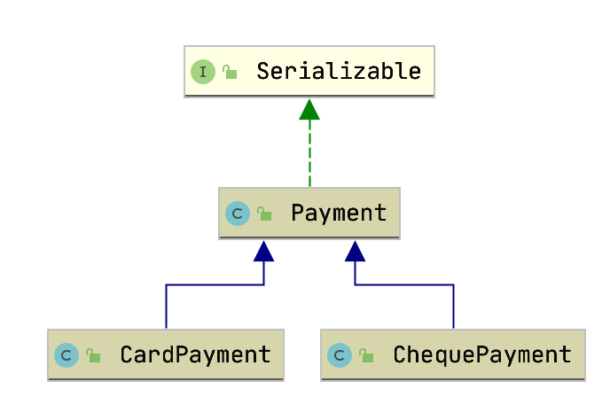

* ### Tanımlar
    Bu çalışmada @Inheritance anotasyonu **TABLE_PER_CLASS** stratejisiyle incelenecektir.
    @Inheritance'ın aldığı strategy değerleri aşağıdaki gibidir.
    - SINGLE_TABLE     
    - **TABLE_PER_CLASS**     
    - JOINED               
    
    ```
    @Entity
    @Table(name = "payment")
    @Inheritance(strategy = InheritanceType.TABLE_PER_CLASS)
    public class Payment implements Serializable {...}
    ```
    ###### NOTE : TABLE_PER_CLASS stratejisiyle kurulan bağlardaki sorgular derin ve uzundur. Dolayısıyla performans problemi olabilecek sistemlerde çok fazla tercih edilmeyen bir stratejidir bu.

* ### Diagram
    Uygulamada kullanılan Entitylerin birbirleriyle ilişkisini gösteren Class diagramı aşağıdaki gibidir.
    Bu çalışmada **ChequePayment** ve **CardPayment** entitylerinin ortak özellikleri **Payment** kısmında toplanarak kod tekrarından kaçılmıştır.
    
   
* ### Payment
    InheritanceType.**TABLE_PER_CLASS** stratejisi ile kurulan ilişkili tablolarda hem üst class için hem de alt classlar için tablo oluşturulmaldır. 
    Bu çalışmadaki örnekte aynı özelliklere sahip 3 tablo anlamına gelir.
    ###### NOTE : Varsayılan durumda üst tabloya(super class) kayıt atılmaz ancak joinlerde üst tabloya select attığı için bu tablonunda DB tarafında tanımlı olması gerekmektedir. 
    ###### NOTE2 : **Abstract classlar** için değil **concrete classlar** için tablo oluşturulur. 
    Alt classlar için birer tablo oluşturulur.
    ```
    @Entity
    @Table(name = "payment")
    @Inheritance(strategy = InheritanceType.TABLE_PER_CLASS)
    public class Payment implements Serializable {
    
        @Id
        @GeneratedValue
        private int id;
    
        private int amount;
    }
    ```
    
    Her class için bir tablo ilişkisi aşağıdaki şekilde kurulur.
    ```
    @Inheritance(strategy = InheritanceType.TABLE_PER_CLASS)
    ```
  
* ### ChequePayment
    ChequePayment adlı entity Payment'dan extend edilerek Payment class'ının özelliklerini almıştır.
    ```
    @Entity
    public class ChequePayment extends Payment {
    
        @Column
        private int chequeNo;
    
        public int getChequeNo() {
            return chequeNo;
        }
    
        public void setChequeNo(int chequeNo) {
            this.chequeNo = chequeNo;
        }
    }
    ```
  
* ### Alt entitylerle ilişki kurulması
    Burada primary key ve DTYPE'a  ihtiyaç yoktur. 
    Her alt entity için bir tablo yaratılacaktır.

* ### endpoint ler ile CRUD işlemleri  
    Çek payment ekleme
    http://localhost:8080/payment/cheque/add
    
    Kart payment ekleme
    http://localhost:8080/payment/card/add
    
    Kayıtları listeleme
    http://localhost:8080/payment/list
    
    ID:2 olan kaydı görüntüleme
    http://localhost:8080/payment/2
    
    ID:3 olan kaydı silme
    curl --location --request DELETE 'http://localhost:8080/payment/delete/3'

* ### Hibernate SQL logları
    Hibenate ile çek ekleme logu
    ```
    Hibernate: 
        insert 
        into
            card_payment
            (amount, card_no, id) 
        values
            (?, ?, ?)
    ```
     
    Hibenate ID:2 olan kaydın logu
    ```
    Hibernate: 
        select
            payment0_.id as id1_9_0_,
            payment0_.amount as amount2_9_0_,
            payment0_.card_no as card_no1_1_0_,
            payment0_.cheque_no as cheque_n1_2_0_,
            payment0_.clazz_ as clazz_0_ 
        from
            ( select
                id,
                amount,
                null as card_no,
                null as cheque_no,
                0 as clazz_ 
            from
                payment 
            union
            all select
                id,
                amount,
                card_no,
                null as cheque_no,
                1 as clazz_ 
            from
                card_payment 
            union
            all select
                id,
                amount,
                null as card_no,
                cheque_no,
                2 as clazz_ 
            from
                cheque_payment 
        ) payment0_ 
    where
        payment0_.id=?
    ```    


[index için tıklayın](../README.md)
