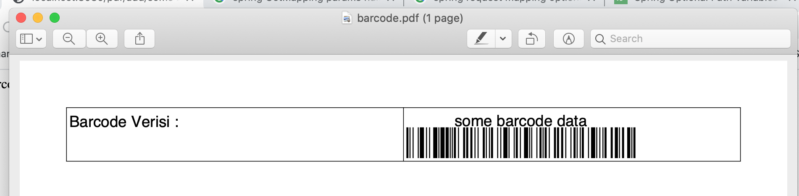

* ### Referanslar
    Bu çalışmadaki örnekler **com.ba.controller.PdfController** adlı classta  kodlanmıştır.
    - Çalışmada barcodeTxt parametresiyle yada parametresiz bir şekilde çağrılacak bir endpoint oluşturlumuştur.
    - Bu endpoint aracılığıyla PDF dosyasına barcode verisi eklenmektedir.
    - Çalışmada, hem barcode oluşturma hemde pdf'e export etme kabiliyeti olan ipdf kütüphanesi(library) kullanılmıştır.

* ### Dependency ekleme 
    pom.xml dosyasına aşağıdaki dependency eklenerek itextpdf projeye dahil edilir.
    ```
    <dependency>
        <groupId>com.itextpdf</groupId>
        <artifactId>itext7-core</artifactId>
        <version>7.1.6</version>
        <type>pom</type>
    </dependency>
    ```    
  
* ### Farklı pathlerler aynı endpoint
    Bu çalışmada aynı zaman parametreli ve parametresiz endpoint nasıl yazılacağı örneklenmiştir.
    **com.ba.controller.PdfController.addBarcode** methodunda  Map tipinde bir @PathVariable tanımı yapılarak  reqestteki tüm parametreler Map datası olarak alınmıştır.
    **@RequestMapping** anotasonuna value parametresi aşağıdaki gibi geçilerek iki URL'in aynı method ile eşlenmesi sağlanmıştır.
    
    ```
    @RequestMapping(value = {"/add", "/add/{barcodeTxt}"}
    ```    
    Burada URL den girilen bir barcode text datası varsa bunu barcode'a çevirecek girilen text data yoksa random olarak oluşturulup barcode a dönüştürülecektir.
    
    methodun tamamı aşağıdaki gibidir.
    ```
    @RequestMapping(value = {"/add", "/add/{barcodeTxt}"}, method = RequestMethod.GET)
    public String addBarcode(@PathVariable Map<String, String> pathVariables) throws Exception {
        String barcodeTxt = null;
    
        if (pathVariables.containsKey("barcodeTxt")) {
            barcodeTxt = pathVariables.get("barcodeTxt");
        }
    
        if (barcodeTxt == null) {
            barcodeTxt = generateBarcodeData();
        }
    
        service.generateBarcodeAndAddToPdf(PDF_FILE_PATH, barcodeTxt);
        return barcodeTxt + " : " + PDF_FILE_PATH;
    }
    ```    

* ### WEB erişim ile test
    Parametresiz URL den erişim
    ```
    http://localhost:8080/pdf/add
    ```
    Parametreli(some barcode data) URL den erişim
    ```
    http://localhost:8080/pdf/add/some%20barcode%20data
    ```

* ### output
    oluşan pdf aşağıdaki gibi olacaktır.
    


[index için tıklayın](../README.md)
