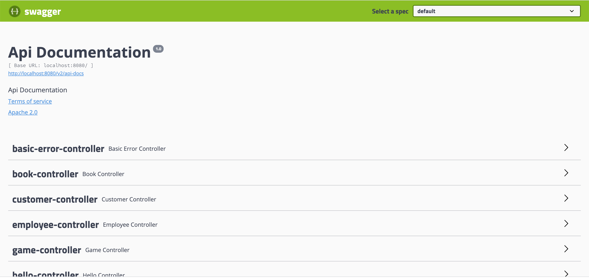

* ### Referanslar
    Bu çalışmadaki configurasyon **com.ba.configuration.SwaggerConfig** adlı class ta kodlanmıştır.

* ### Bağımlılıklar
    **Swagger**'ı projede kullanabilmek için aşağıdaki bağımlılıkların **pom.xml** dosyasına eklenmesi gerekmektedir.
    ```
    <dependency>
        <groupId>io.springfox</groupId>
        <artifactId>springfox-swagger2</artifactId>
        <version>2.9.2</version>
        <scope>compile</scope>
    </dependency>
    
    <dependency>
        <groupId>io.springfox</groupId>
        <artifactId>springfox-swagger-ui</artifactId>
        <version>2.9.2</version>
        <scope>compile</scope>
    </dependency>
    ```

* ### Kofigurasyonlar
    SwaggerConfig adında bir Configuration class'ı oluşturulur. İçine aşağıdaki satılar eklenir.
    
    ```
    @Configuration
    @EnableSwagger2
    public class SwaggerConfig {
    
        @Bean
        public Docket docket(){
            return new Docket(DocumentationType.SWAGGER_2).select().build();
        }
    
    }
    ```
    
* ### NOTLAR
    - Burada  default configuratin ile kullanım gösterilmiştir.
    - Developer Info,Application Info, Terms of Service gibi genel bilgiler değiştirilebilmektedir.

* ### Kullanım örnekleri
    Üstteki ayarları yaptıktan sonra broser üzerinden aşağıdaki adrese gidildiğinde tüm endpointlerin listesi collapsible menü ile gelecektir.
    http://localhost:8080/swagger-ui.html
    
    


* ### Kullanım örnekleri
    - **add Todo :** http://localhost:8080/swagger-ui.html#/todo-controller/addTodoUsingGET
    - **get Todo :** http://localhost:8080/swagger-ui.html#/todo-controller/getAllTodoUsingGET
    
* ### Swagger anotasyonların
    - **@Api** anotasyonu ile  controllerlara(resources) açıklama eklenebilir. Kullanım örneği **com.ba.controller.TodoController** adlı classtadır.
        ```
        @Api(tags = "Todo Operations")
        @RestController
        @RequestMapping("todo")
        public class TodoController {...}
        ```     
    - **@ApiOperation** anotasyonu ile controllerdaki methodlara açıklama eklenebilir. 
        ```
        @ApiOperation(value = "Add todo", notes = "Generate Todo Object and Add to DB")
        ```
    
    - **@ApiResponse** anotasyonu ile isteklere hangi status code unun döneceği belirtilebilir.
        ```
        @ApiResponses(value = {
                @ApiResponse(code = 201, message = "Record created successfully"),
                @ApiResponse(code = 409, message = "ID already taken")
        })
        ``` 

[index için tıklayın](../README.md)
