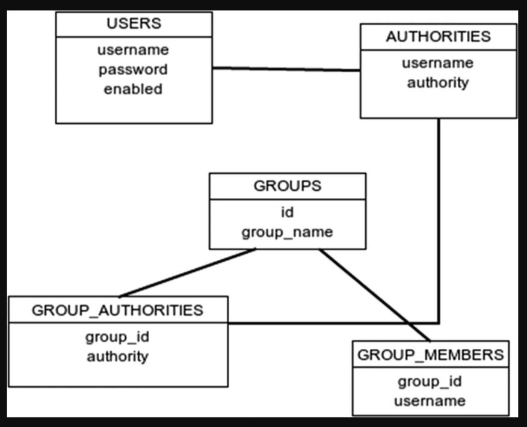

* ### Referanslar
    Bu çalışmadaki örnekler **spring-basic-auth-example** adlı projede  kodlanmıştır.
    
* ### Açıklamalar
    - Spring security nin varsayılan auth yöntemi basic auth tur.
    - Spring security dependency class pathe eklenince spring basic authentication ı aktif eder.
    - Varsayılan **username: user** şeklindedir. 
    - Uygulama her ayağa kalktığında ise random olarak bir password generate edilir. Generate edilen password aşağıdaki şekilde loga yazılır.
    ```
    Using generated security password: 36744b4a-4623-4cc4-9009-adf96f24d20f
    ```    
    - Uygulamada **WebSecurityConfigurerAdapter** class'ı extend edildiği zaman default konfigurasyon kaybolur.
    ```
    @Configuration
    public class SecurityConfig extends WebSecurityConfigurerAdapter {...}
    ```    

* ### Yetki Tabloları
    - Spring Security ile basic auth işlemi yapılırken Spring aşağıdaki tabloları sorgulayarak yanıt döner. Eğer alltaki 3 tabloda(GROUPS, GROUP_AUTHORITIES, GROUP_MEMBERS)  kayıt bulamazsa ilk iki tabloya(USERS, AUTHORITIES) bakarak yanıt döner.
        - **USERS,**
        - **AUTHORITIES,**
        - GROUPS,
        - GROUP_AUTHORITIES,
        - GROUP_MEMBERS
        
        
    - Bu çalışmada sadece **USERS** ve **AUTHORITIES** tablolarını doldurarak işlem yapılmıştır.
    - Tablo create scriptleri **resources/schema.sql** dosyasına eklenmelidir.
    ```
    CREATE TABLE USERS (
      USERNAME VARCHAR(250) NOT NULL PRIMARY KEY,
      PASSWORD VARCHAR(512) NOT NULL,
      ENABLED BOOLEAN NOT NULL
    );
    
    CREATE TABLE AUTHORITIES (
      USERNAME VARCHAR(250) NOT NULL,
      AUTHORITY VARCHAR(250) NOT NULL
    );
    ```
    - insert cümleleri  **resources/data.sql** dosyasına eklenmelidir.
    ```
    INSERT INTO USERS VALUES ('user1','{noop}pass1',true);
    INSERT INTO USERS VALUES ('user2','{noop}pass2',true);
    INSERT INTO USERS VALUES ('admin','{noop}pass3',true);
    
    INSERT INTO AUTHORITIES VALUES ('user1','ROLE_USER');
    INSERT INTO AUTHORITIES VALUES ('user2','ROLE_USER');
    INSERT INTO AUTHORITIES VALUES ('user2','ROLE_ADMIN');
    INSERT INTO AUTHORITIES VALUES ('admin','ROLE_ADMIN');
    ```
###### NOTE : {noop} ->   Varsayılanda olduğu gibi NoOpPasswordEncoder kullanılacak anlamındadır. Farklı encoderlar kullanılarak ta şifreler encript edilebilir.  
   
* ### Configuration işlemleri

    - SecurityConfig adında bir configuration classı oluşturarak WebSecurityConfigurerAdapter den extends edilmelidir.
    ```
    @Configuration
    public class SecurityConfig extends WebSecurityConfigurerAdapter {...}
    ```    
    
    - SpringBoot JDBC işlemi ile auth kontrolü yaptığı için ve uygulama ayağa kalkarken instance yaratması için DataSource class'ı autowire edilmelidir.
    ```
    @Autowired
    private DataSource dataSource;
    ```
    
    - Autowired edilen DataSource bean'i AuthenticationManager'a build yöntemi ile set edilmelidir.
    ```
    @Override
    protected void configure(AuthenticationManagerBuilder auth) throws Exception {
        auth.jdbcAuthentication().dataSource(dataSource);
    }
    ```
    
    - HttpSecurity aşağıdaki şekilde configure edilmelidir.
    ```
    @Override
    protected void configure(HttpSecurity http) throws Exception {
        http.authorizeRequests().antMatchers("h2-console/**").permitAll();
        http.csrf().disable();//disable csrf
        http.headers().frameOptions().disable();//disable frame options
        http.authorizeRequests().antMatchers("/hi/user").access("hasAnyRole('USER','ADMIN')");
        http.authorizeRequests().antMatchers("/hi/admin").access("hasRole('ADMIN')");
        http.httpBasic();
    }
    ```
    
    - Üstteki tanıma göre 
        - h2-console'a erişim için ilk satırda h2-console/ şeklinde başlayan tüm pathler public erişime açılmıştır.
        ```
        http.authorizeRequests().antMatchers("h2-console/**").permitAll();
        ```    
    
        - **hasAnyRole('USER','ADMIN')** ve **hasRole('ADMIN')** tanımı ile **/hi/user** ve **/hi/admin** endpointlerinin yetkileri tanımlanmış olur.
        ```
        http.authorizeRequests().antMatchers("/hi/user").access("hasAnyRole('USER','ADMIN')");
        http.authorizeRequests().antMatchers("/hi/admin").access("hasRole('ADMIN')");
        ```    
* ### Controller katmanına endpointlerin eklenmesi
    ```
    @RestController
    @RequestMapping("/hi")
    public class HelloController {
    
        @GetMapping("/user")
        public String sayHelloForUser() {
            return "Hi from controller as USER";
        }
    
        @GetMapping("/admin")
        public String sayHelloForAdmin() {
            return "Hi from controller as ADMIN";
        }
    
    }
    ```

* ### endpoint requestleri
    - User ekranı erişimi(Bu endpointe user yada admin rolüne sahip kullanıcılar erişir)
    ```
    curl --location --request GET 'localhost:8080/hi/user' \
    --header 'Authorization: Basic dXNlcjI6cGFzczI='
    ```    
    
    - admin ekranı erişimi(Bu endpointe sadece admin rolüne sahip kullanıcılar erişir)
    ```
    curl --location --request GET 'localhost:8080/hi/admin' \
    --header 'Authorization: Basic dXNlcjI6cGFzczI='
    ```

###### NOTE: Header'a Authorization bilgisi aşağıdaki şekilde eklenmelidir.
```
Authorization: Basic dXNlcjI6cGFzczI=
```

Basic ten sonraki data **Username:Password** bilgilerinin base64 olarak encode edilmiş halidir.


[index için tıklayın](../README.md)
